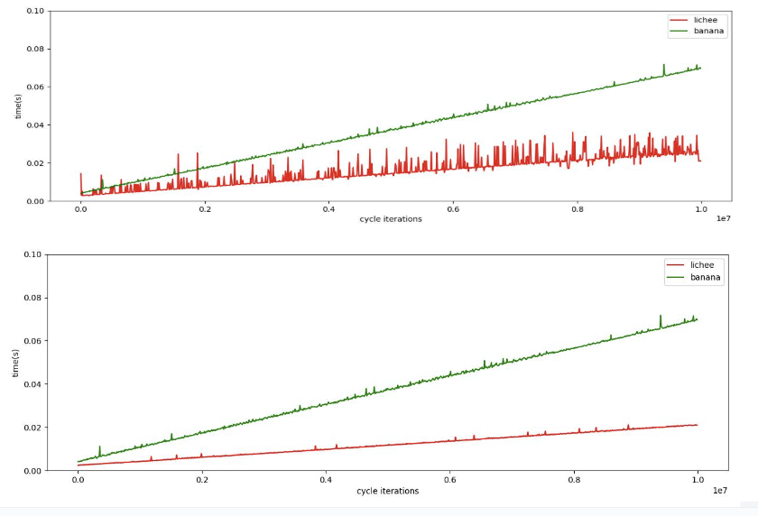

# FMA benchmark

Бенчмарк направлен на тестирование операций FMA (Fused-Multiply Add, умножение-сложение): fmadd и fmsub на разных платах в двух вариантах: как функция на языке C и как ассемблерная инструкция (с помощью ассемблерных вставок)
## Условия эксперимента
Платы: LicheePi 4A; Banana Pi BPI-F3

Lichee
```
4 cores

cpu-freq        : 1.848Ghz
cpu-icache      : 64KB
cpu-dcache      : 64KB
cpu-l2cache     : 1MB
cpu-tlb         : 1024 4-ways
cpu-cacheline   : 64Bytes
cpu-vector      : 0.7.1
```
Banana
```
8 cores

CPU(s) scaling MHz:  100%
  CPU max MHz:         1600.0000
  CPU min MHz:         614.4000
```
Одной из проблем был троттлинг платы Lichee - график, иллюстрирующий поведение до и после фиксирования частоты



По сравнению с этим графиком был изменён принцип замеров: вместо 1 замера на 1 кол-во циклов проводились 20 замеров и бралось минимальное время

## Код
Основное тело цикла бенчмарки:
```c
double fmadd(int32_t marg, volatile double darg, double aarg, double barg,
             double carg) {
    for (int32_t i = 0; i < marg; i++) {
        darg = aarg + barg * carg;
        darg = aarg + barg * carg;
        darg = aarg + barg * carg;
        darg = aarg + barg * carg;
        darg = aarg + barg * carg;
        darg = aarg + barg * carg;
        darg = aarg + barg * carg;
        darg = aarg + barg * carg;
        darg = aarg + barg * carg;
        darg = aarg + barg * carg;
    }
    return darg;
}
```
Основное тело цикла бенчмарки с ассемблерными вставками:
```c
double fmadd(int32_t marg, volatile double darg, double aarg, double barg,
             double carg) {
    for (int32_t i = 0; i < marg; i++) {
        asm volatile("fmadd.d %0, %1, %2, %3"
                     : "=f"(darg)
                     : "f"(barg), "f"(carg), "f"(aarg));
        asm volatile("fmadd.d %0, %1, %2, %3"
                     : "=f"(darg)
                     : "f"(barg), "f"(carg), "f"(aarg));
        asm volatile("fmadd.d %0, %1, %2, %3"
                     : "=f"(darg)
                     : "f"(barg), "f"(carg), "f"(aarg));
        asm volatile("fmadd.d %0, %1, %2, %3"
                     : "=f"(darg)
                     : "f"(barg), "f"(carg), "f"(aarg));
        asm volatile("fmadd.d %0, %1, %2, %3"
                     : "=f"(darg)
                     : "f"(barg), "f"(carg), "f"(aarg));
        asm volatile("fmadd.d %0, %1, %2, %3"
                     : "=f"(darg)
                     : "f"(barg), "f"(carg), "f"(aarg));
        asm volatile("fmadd.d %0, %1, %2, %3"
                     : "=f"(darg)
                     : "f"(barg), "f"(carg), "f"(aarg));
        asm volatile("fmadd.d %0, %1, %2, %3"
                     : "=f"(darg)
                     : "f"(barg), "f"(carg), "f"(aarg));
        asm volatile("fmadd.d %0, %1, %2, %3"
                     : "=f"(darg)
                     : "f"(barg), "f"(carg), "f"(aarg));
        asm volatile("fmadd.d %0, %1, %2, %3"
                     : "=f"(darg)
                     : "f"(barg), "f"(carg), "f"(aarg));
    }
    return darg;
}
```
Аналогичный код был написан для инструкции `fmsub`

Дублирование кода инструкций в телах циклов необходимо для того, чтобы наиболее "горячими" (т.е. наиболее часто исполняющиеся в ходе работы программы) были инструкции, действительно относящиеся к функции (т.н. loop unrolling) (в данном случае - `fadd.d` и `fmul.d`).

Рассмотрим на примере функции `fmadd`.

Так выглядит профилировка с одной операцией сложения в цикле:


Видно, что большую часть работы занимают инструкции `sext.w` и `lw`, в то время как нужные нам инструкции `fadd.d` и `fmul.d` занимают менее 9% от всего времени работы

Если же продублировать операцию сложения:


Инструкции `sext.w` и `lw` выполняются меньшее кол-во времени, а инструкции сложения и умножения в сумме занимают ~77%, поэтому такой код можно использовать для тестирования

Горячий код (с ассемблерными вставками) (~92% занимает инструкция `fmsub.d`, поэтому данный код подходит для тестирования):


## Окружение и инструкция по запуску:
Тулчейн:
  * Компилятор - `gcc`
  * Профилировщики - `linux-perf` и `gprof`

**Сборка и ключи компиляции**
```
gcc -g main.c -o main -O0 -pg

gcc  -fno-verbose-asm -march=rv64id main_asm.c -o main_asm -O3 -pg
```
Ключи `-pg` и `-fno-verbose-asm` создают дополнительную информацию, полезную при профилировке и отладке (не используются для контрольных замеров в целях чистоты эксперимента)

Ключ `-O` устанавливает степень оптимизации компилятора

Ключ `-march=rv64id` подключает расширение RISC-V для работы c double

**Скрипт для просмотра горячего кода (аналогично для бенчмарка с ассемблерными вставками)**
```bash
cd ../
perf record -e cpu-clock ./main $1 $2
perf report
```


**Скрипт для замеров и записи значений в отдельный файл (аналогично для бенчмарка с ассемблерными вставками)**
```bash
#!/bin/bash
cd ../
rep=20
iter=100000
n=10000000
gcc -g main.c -o main -O0 -pg
if [[ $1 == 1 ]]; then
	for ((i = 1; i < $n + 1; i+=$iter))
	do
	perf stat -o out_fmadd.txt -r $rep --table ./main $1 $i
	grep ") #" out_fmadd.txt > out2_fmadd.txt
	cat out2_fmadd.txt | cut -d"(" -f1 >> out3_fmadd.txt
	done
else
	for ((i = 1; i < $n + 1; i+=$iter))
	do
	perf stat -o out_fmsub.txt -r $rep --table ./main $1 $i
	grep ") #" out_fmsub.txt > out2_fmsub.txt
	cat out2_fmsub.txt | cut -d"(" -f1 >> out3_fmsub.txt
	done
fi
```

Запуск: `./bench.sh <номер функции: 1 - fmadd, 2 - fmsub>` (для функций с ассемблерными вставками - `bench_asm.sh`)

Скрипт создаёт файлы вида `out3_<имя_функции>_<ассемблер>.txt`.
Файлы с платы Lichee должны иметь вид `out3_fmadd.txt`/`out3_fmadd_asm.txt`, с Banana - `banana_out3_fmadd.txt/banana_out3_fmadd_asm.txt`. Аналогично файлы называются для инструкции `fmsub`

**Важно: при повторном запуске на одну и ту же функцию нужно удалить файл прошлого запуска `out3_<имя_функции>_<ассемблер>.txt`**

Эти файлы принимаются на вход программы построения графиков `test.py`

Запуск: `python test.py <значение переменной rep в скрипте для замеров>`

Например: `python test.py 20`

Переменная `rep` - количество запусков на некотором значении количества операций, среди которых выбирается минимальное время

Примечание: для запуска нужна библиотека `matplotlib`
# Результаты работы бенчмарка

Контрольные замеры проводились в условиях изоляции плат от сети

## Fmadd


По графику можно сделать вывод, что на операции `fmadd` Lichee работает быстрее Banana

## Fmadd(ассемблер)


В сравнении с бенчмарком без ассемблерных вставок обе платы показывают лучший результат

## Fmsub


На плате Lichee инструкции `fmadd` и `fmsub` работают примерно одинаково, можно увидеть, что на плате Banana `fmsub` работает несколько медленнее

## Fmsub(ассемблер)


Ситуация, аналогичная `fmadd`: на обеих платах код с ассемблерными вставками работает быстрее, на Banana `fmsub` и `fmadd` работают примерно одинаково

В целом, можно сделать вывод, что FMA-инструкции работают быстрее на плате Lichee; на обеих платах программа ускоряется при использовании ассемблерных вставок