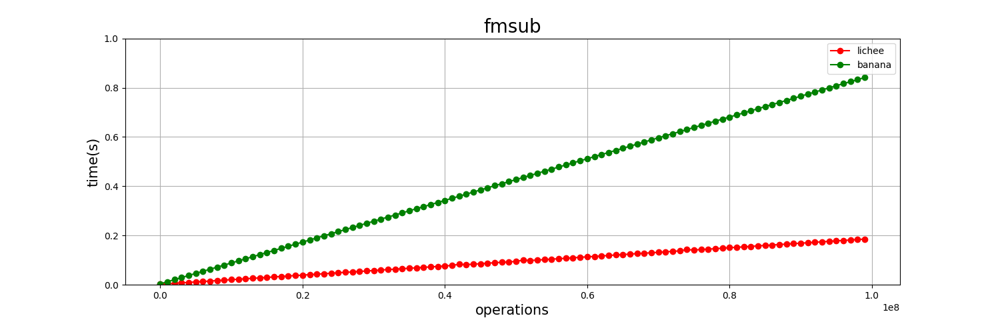

# FMA benchmark

Бенчмарк направлен на тестирование операций FMA (Fused-Multiply Add, умножение-сложение): fmadd и fmsub на разных платах в двух вариантах: как функция на языке C и как ассемблерная инструкция (с помощью ассемблерных вставок)

Основное тело цикла:
```c
double fmadd(int m, volatile double d, double a, double b, double c) {
  for (int32_t i = 0; i < m; i++) {
    d = a + b * c;
    d = a + b * c;
    d = a + b * c;
    d = a + b * c;
    d = a + b * c;
    d = a + b * c;
    d = a + b * c;
    d = a + b * c;
    d = a + b * c;
    d = a + b * c;
  }
  return d;
}
```
Ассемблерная инструкция:
```c
double fmadd(int m, volatile double d, double a, double b, double c) {
  for (int32_t i = 0; i < m; i++) {
    asm volatile("fmadd.d %0, %1, %2, %3" : "=f"(d) : "f"(b), "f"(c), "f"(a));
    asm volatile("fmadd.d %0, %1, %2, %3" : "=f"(d) : "f"(b), "f"(c), "f"(a));
    asm volatile("fmadd.d %0, %1, %2, %3" : "=f"(d) : "f"(b), "f"(c), "f"(a));
    asm volatile("fmadd.d %0, %1, %2, %3" : "=f"(d) : "f"(b), "f"(c), "f"(a));
    asm volatile("fmadd.d %0, %1, %2, %3" : "=f"(d) : "f"(b), "f"(c), "f"(a));
    asm volatile("fmadd.d %0, %1, %2, %3" : "=f"(d) : "f"(b), "f"(c), "f"(a));
    asm volatile("fmadd.d %0, %1, %2, %3" : "=f"(d) : "f"(b), "f"(c), "f"(a));
    asm volatile("fmadd.d %0, %1, %2, %3" : "=f"(d) : "f"(b), "f"(c), "f"(a));
    asm volatile("fmadd.d %0, %1, %2, %3" : "=f"(d) : "f"(b), "f"(c), "f"(a));
    asm volatile("fmadd.d %0, %1, %2, %3" : "=f"(d) : "f"(b), "f"(c), "f"(a));
  }
  return d;
}
```
(аналогично для fmadd)

Дублирование кода инструкций в теле циклов необходимо для того, чтобы наиболее "горячими" были инструкции, действительно относящиеся к функции (т.н. loop unrolling) (в данном случае - `fadd.d` и `fsub.d`).

Рассмотрим на примере функции fmadd:
Так выглядит профилировка с одной операцией сложения в цикле:


Видно, что большую часть работы занимают инструкции `sext.w` и `lw`, в то время как нужные нам инструкции `fadd.s` и `fmul.s` занимают менее 9% от всего времени работы

Если же продублировать операцию сложения:


Инструкции `sext.w` и `lw` выполняются меньшее кол-во времени, а инструкции сложения и умножения в сумме занимают ~77%, поэтому такой код можно использовать для тестирования

## Окружение:
* Сборка и ключи компиляции
```makefile
all: main main_asm
main: main.c
        gcc -g main.c -o main -O0 -pg
main_asm: main_asm.c
        gcc  -fno-verbose-asm -march=rv64id main_asm.c -o main_asm -O0 -pg
```
Ключи `-g`, `-pg` и `-fno-verbose-asm` создают дополнительную информацию, полезную при профилировке и отладке (`-pg`, в частности, создаёт `gmon.out` для профилировщика `gprof`)
Ключ `-O0` отключает оптимизации компилятора
Ключ `-march=rv64id` подключает расширение RISC-V для работы c double
* Скрипт для просмотра горячего кода (аналогично для бенчмарка с ассемблерными вставками)
```bash
cd ../
perf record -e cpu-clock ./main $1 $2
perf report
```


* Скрипт для замеров и записи значений в отдельный файл (аналогично для бенчмарка с ассемблерными вставками)
```bash
cd ../
for ((i = 1; i < 1000000 + 1; i+=1000))
do
if [[ $1 == 1 ]]; then
        perf stat -o outfmadd.txt  ./main $1 $i
        grep elapsed outfmadd.txt > out2fmadd.txt
        cat out2fmadd.txt | cut -d"s" -f1 >> out3fmadd.txt
else
        perf stat -o outfmsub.txt  ./main $1 $i
        grep elapsed outfmsub.txt > out2fmsub.txt
        cat out2fmsub.txt | cut -d"s" -f1 >> out3fmsub.txt
fi
done
```

## Результаты работы бенчмарка

# Fmadd

# Fmadd(ассемблер)

# Fmsub

# Fmsub(ассемблер)
