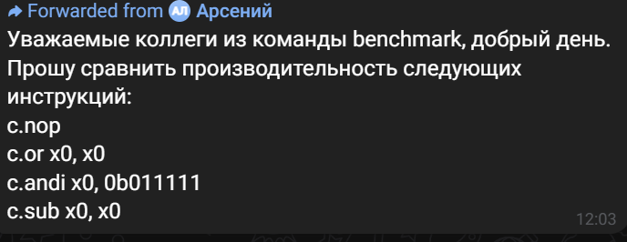
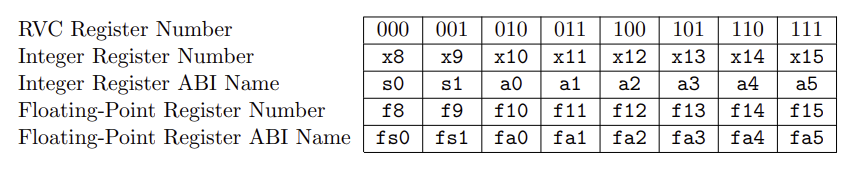
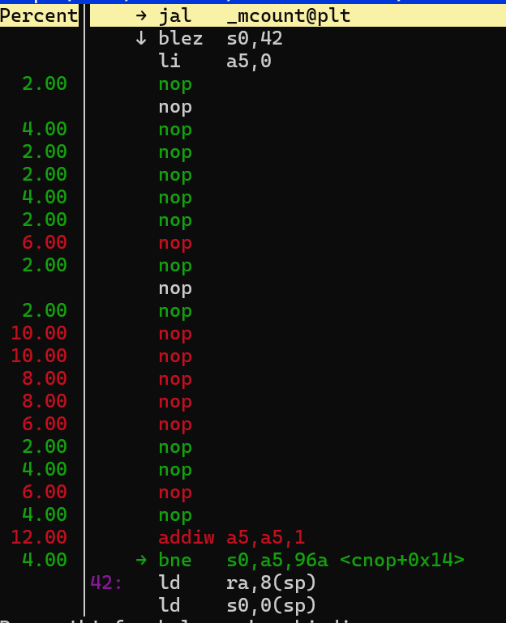
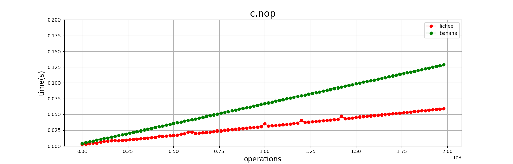

# Watermark benchmark

Поступила просьба от команды Watermark протестировать следующие инструкции:




В ходе исследования выяснилось, что compressed инструкции работают только с регистрами x8 - x15, поэтому запрос является нерелевантым и замеры проводились только для `c.nop`




Горячий код (наиболее часто исполняющийся код):




Скрипт просмотра горячего кода:

```bash
#!/bin/bash
cd ../
gcc  -fno-verbose-asm -march=rv64idc wm_bench.c -o wm_bench -O0 -pg
perf record -e cpu-clock ./wm_bench $1 $2
perf report
```
Скрипт запуска бенчмарка:

```bash
#!/bin/bash
gcc  -fno-verbose-asm -march=rv64idc wm_bench.c -o wm_bench -O0 -pg
rep=20
iter=100000
n=10000000

for ((i = 1; i < $n + 1; i+=$iter))
do
perf stat -o out.txt -r $rep --table ./wm_bench $i
grep ") #" out.txt > out2.txt
cat out2.txt | cut -d"(" -f1 >> out3.txt
done
```


Запуск: `./bench.sh <кол-во циклов>` (для функций с ассемблерными вставками - `bench_asm.sh`)

Скрипт создаёт файлы вида `<имя_платы>_out3.txt`.
Файлы с платы Lichee должны иметь вид `out3.txt`, с Banana - `banana_out3.txt`.

Эти файлы нужны для запуска программы построения графиков `test.py`

Запуск: `python test.py <значение переменной rep в скрипте для замеров>`

Например: `python test.py 20`

Переменная `rep` - количество запусков на некотором значении количества операций, среди которых выбирается минимальное время

Примечание: для запуска нужна библиотека `matplotlib`

## Результаты бенчмарка



По графику можно сделать вывод, что `c.nop` работает быстрее на плате Lichee