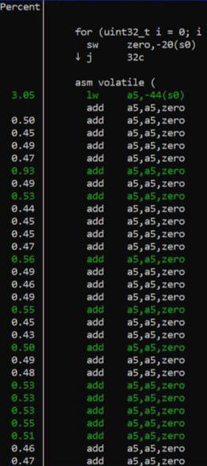

# ADD.i vs ADD comparision 

Бенчмарк направлен на сравнение производительности инструкций “add.i dst, src, 0” и “add dst, src, zero”.
Для выполнения этой задачи был написан код на языке C с использованием ассемблерных вставок.  

Цикл для add c ассемблерыми вставками:
```c
void measure_add(int iterations, int dst, int src) {
    for (uint32_t i = 0; i < iterations; ++i) {
        asm volatile (
            " add %0, %1, x0;"
            " add %0, %1, x0;"
            " add %0, %1, x0;"
            " add %0, %1, x0;"
            " add %0, %1, x0;"
            " add %0, %1, x0;"
            " add %0, %1, x0;"
            " add %0, %1, x0;"
            " add %0, %1, x0;"
            " add %0, %1, x0;"
            : "=r" (dst)
            : "r" (src)
        );
        
    }
```

Цикл для add.i c ассемблерыми вставками :
```c
void measure_add(int iterations, int dst, int src) {
    for (uint32_t i = 0; i < iterations; ++i) {
        asm volatile (
            " addi %0, %1, 0;"
            " addi %0, %1, 0;"
            " addi %0, %1, 0;"
            " addi %0, %1, 0;"
            " addi %0, %1, 0;"
            " addi %0, %1, 0;"
            " addi %0, %1, 0;"
            " addi %0, %1, 0;"
            " addi %0, %1, 0;"
            " addi %0, %1, 0;"
            : "=r" (dst)
            : "r" (src)
        );
        
    }
```

Для увеличения времени выполнения исследуемых команд ("addi %0, %1, 0;" и " add %0, %1, x0;") их количество в цикле было увеличено до 190 штук, а количество циклов равно 1,000,000,000.
По итогу добились того, что необходимые инструкции занимают 92% и 95% нагрузки на процессор.

Программа была запущена на плате Banana PI.

Для инструкции add были получены следующие результаты:

Профилировка: (perf record -e cpu-clock ./название файла >> perf report)



Время работы – 10 прогонов (perf stat -r 10 ./название файла):


Для инструкции add.i были получены следующие результаты:

Профилировка:


Наблюдается автоматическая замена компилятором инструкции "addi rd,rs,0" (с третьим аргументом =0) на аналогичную "mv rd,rs". Это описано в Risс-V instruction set manual vol.1 - раздел 2.4 (https://github.com/riscv/riscv-isa-manual?tab=readme-ov-file)

Время работы – 10 прогонов


Исходя из полученных результатов можно сделать вывод что инструкция add выполняется быстрее чем add.i в 8 раз. Скорее всего это происходит из-за интерпретации команды add.i в mv.

# Инструкция по воспроизведению эксперимента

Плата - Banana Pi BPI-F3.

Шаг первый: 
Cкомпилировать программу коммандой: gcc -g название_файла.с -o название_файла.out
, где g - ключ добавляющий дополнительную информацию в дебаггер. Для контрольных замеров не использовался.
o - ключ записывающий исходный файл в название_файла.out.
Шаг второй:
Получить данные профилирования в файл perf.data с помощью команды: perf record -e cpu-clock ./название_файла.out 
, где -e cpu-clock - показывает, что нас интересуют именно замеры процессора.
Шаг третий:
Открыть файл perf.data в интерактивном виде с помощью команды: perf report
Шаг четвертый:
Получить данные по времени работы программы с помощью работы команды: perf stat -r 10 ./название_файла.out
, где -r показывает сколько раз была запущена программа (в данном случае 10).

# Необходимые инструменты

Комилятор gcc,
linux-perf

