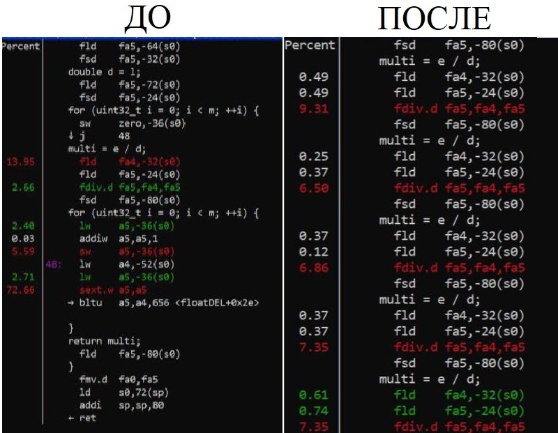
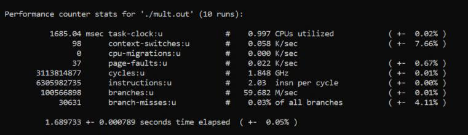

# Operations with floating point benchmark

Бенчмарк направлен на тестирование операций сложения, вычитания, деления и умножения чисел с плавающей запятой.

Было написано 4 программы на каждую из операций соответственно. 

Основное тело цикла бенчмарка сложения:
```c
double floatADD(int counter, double main_argument_1, double main_argument_2, double result) {
    double extra_argument_1 = main_argument_1;
    double extra_argument_2 = main_argument_2;

    for (uint32_t i = 0; i < counter; ++i) {
        result = main_argument_1 + main_argument_2;
        result = main_argument_1 + main_argument_2;
        result = main_argument_1 + main_argument_2;
        result = main_argument_1 + main_argument_2;
        result = main_argument_1 + main_argument_2;
        result = main_argument_1 + main_argument_2;
        result = main_argument_1 + main_argument_2;
        result = main_argument_1 + main_argument_2;
        result = main_argument_1 + main_argument_2;
        result = main_argument_1 + main_argument_2;
                                     
    }
    return result;
}
```
Основное тело цикла бенчмарка вычитания:
```c
double floatSUB(int counter, double main_argument_1, double main_argument_2, double result) {
    double extra_argument_1 = main_argument_1;
    double extra_argument_2 = main_argument_2;

    for (uint32_t i = 0; i < counter; ++i) {
        result = main_argument_1 - main_argument_2;
        result = main_argument_1 - main_argument_2;
        result = main_argument_1 - main_argument_2;
        result = main_argument_1 - main_argument_2;
        result = main_argument_1 - main_argument_2;
        result = main_argument_1 - main_argument_2;
        result = main_argument_1 - main_argument_2;
        result = main_argument_1 - main_argument_2;
        result = main_argument_1 - main_argument_2;
        result = main_argument_1 - main_argument_2;
                                     
    }
    return result;
}
```
Основное тело цикла бенчмарка умножения:
```c
double floatMUL(int counter, double main_argument_1, double main_argument_2, double result) {
    double extra_argument_1 = main_argument_1;
    double extra_argument_2 = main_argument_2;

    for (uint32_t i = 0; i < counter; ++i) {
        result = main_argument_1 * main_argument_2;
        result = main_argument_1 * main_argument_2;
        result = main_argument_1 * main_argument_2;
        result = main_argument_1 * main_argument_2;
        result = main_argument_1 * main_argument_2;
        result = main_argument_1 * main_argument_2;
        result = main_argument_1 * main_argument_2;
        result = main_argument_1 * main_argument_2;
        result = main_argument_1 * main_argument_2;
        result = main_argument_1 * main_argument_2;
                                     
    }
    return result;
}
```
Основное тело цикла бенчмарка деления:
```c
double floatDIV(int counter, double main_argument_1, double main_argument_2, double result) {
    double extra_argument_1 = main_argument_1;
    double extra_argument_2 = main_argument_2;

    for (uint32_t i = 0; i < counter; ++i) {
        result = main_argument_1 / main_argument_2;
        result = main_argument_1 / main_argument_2;
        result = main_argument_1 / main_argument_2;
        result = main_argument_1 / main_argument_2;
        result = main_argument_1 / main_argument_2;
        result = main_argument_1 / main_argument_2;
        result = main_argument_1 / main_argument_2;
        result = main_argument_1 / main_argument_2;
        result = main_argument_1 / main_argument_2;
        result = main_argument_1 / main_argument_2;
                                     
    }
    return result;
}
```
Дублирование кода инструкций в теле циклов (loop unrolling) необходимо для того, чтобы инструкции, производительность которых мы измеряем ("fdiv.f", "fadd.d", "fsub.d", "fmul.d"), занимали больший процент нагрузки процессора относительно других.

Paзницу можно наглядно увидеть сравнив профилировку кода бенчмарка деления до и после loop unrolling.



Видно, что до применения - операции "fld" и "sext.w" - занимают 90 процентов нагрузки компьютера, а интересные нам - около 3 процентов.
Теперь, применив, loop unrolling, исследуемая оперяция "f.div" - является горячим кодом и занимает около 95 процентов нагрузки от программы. 

## Результаты работы бенчмарка

# fadd.d - операция сложения - Banana PI

# fadd.d - операция сложения - Lichiee PI

# fsub.d - операция вычитания - Banana PI

# fsub.d - операция вычитания - Lichiee PI

# fmul.d - операция умножения - Banana PI

# fmul.d - операция умножения - Lichiee PI

# fdiv.d - операция деления - Banana PI

# fdiv.d - операция деления - Lichiee PI


Исходя из данных результатов - можно сделать вывод, что на плате Lichee Pi - результаты в несколько раз выше. Это поддтверждает более высокую частоту процессора на плате.

Платы - Banana Pi BPI-F3, Sispeed LicheePi 4A

Шаг первый: 
Cкомпилировать программу коммандой: gcc -g название_файла.с -o название_файла.out
, где g - ключ добавляющий дополнительную информацию в дебаггер. Для контрольных замеров не использовался.
o - ключ записывающий исходный файл в название_файла.out.
Шаг второй:
Получить данные профилирования в файл perf.data с помощью команды: perf record -e cpu-clock ./название_файла.out 
, где -e cpu-clock - показывает, что нас интересуют именно замеры процессора.
Шаг третий:
Открыть файл perf.data в интерактивном виде с помощью команды: perf report
Шаг четвертый:
Получить данные по времени работы программы с помощью работы команды: perf stat -r 10 ./название_файла.out
, где -r показывает сколько раз была запущена программа (в данном случае 10).

# Необходимые инструменты

Комилятор gcc,
linux-perf