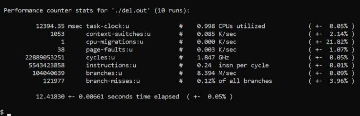

# Operations with floating point benchmark

Бенчмарк направлен на тестирование операций сложения, вычитания, деления и умножения чисел с плавающей запятой.

Было написано 4 программы на каждую из операций соответственно. 

Основное тело цикла бенчмарка сложения:
```c
double floatSUM(int m, double y, double l, double multi) {
    double e = y;
    double d = l;
    for (uint32_t i = 0; i < m; ++i) {
        multi = e + d;
        multi = e + d;
        multi = e + d;
        multi = e + d;
        multi = e + d;
        multi = e + d;
        multi = e + d;
        multi = e + d;
        multi = e + d;
        multi = e + d;
        multi = e + d;
        multi = e + d;                                             
    }
    return multi;
}
```
Основное тело цикла бенчмарка вычитания:
```c
double floatDIFF(int m, double y, double l, double multi) {
    double e = y;
    double d = l;
    for (uint32_t i = 0; i < m; ++i) {
        multi = e - d;
        multi = e - d;
        multi = e - d;
        multi = e - d;
        multi = e - d;
        multi = e - d;  
        multi = e - d;
        multi = e - d;
        multi = e - d;
        multi = e - d;
        multi = e - d;
        multi = e - d;
        multi = e - d;  
        multi = e - d;                                             
    }
    return multi;
}
```
Основное тело цикла бенчмарка умножения:
```c
double floatMUL(int m, double y, double l, double multi) {
    double e = y;
    double d = l;
    for (uint32_t i = 0; i < m; ++i) {
        multi = e * d;
        multi = e * d;
        multi = e * d;
        multi = e * d;
        multi = e * d;
        multi = e * d;  
        multi = e * d;
        multi = e * d;
        multi = e * d;
        multi = e * d;
        multi = e * d;
        multi = e * d;
        multi = e * d;  
        multi = e * d;                                             
    }
    return multi;
}
```
Основное тело цикла бенчмарка деления:
```c
double floatDEL(int m, double y, double l, double multi) {
    double e = y;
    double d = l;
    for (uint32_t i = 0; i < m; ++i) {
        multi = e / d;
        multi = e / d;
        multi = e / d;
        multi = e / d;
        multi = e / d;
        multi = e / d;
        multi = e / d;
        multi = e / d;
        multi = e / d;
        multi = e / d;
        multi = e / d;
        multi = e / d;                                             
    }
    return multi;
}
```
Дублирование кода инструкций в теле циклов (loop unrolling) необходимо для того, чтобы инструкции, производительность которых мы измеряем, нагружали процессор больше всего и являлись "горячим кодом" действительно относящиеся к функции.

Paзницу можно наглядно увидеть сравнив профилировку кода бенчмарка деления до и после loop unrolling.


Видно, что до применения - операции "fld" и "sext.w" - занимают 90 процентов нагрузки компьютера, а интересные нам - около 3 процентов.
Теперь, применив, loop unrolling, исследуемая оперяция "f.div" - является горячим кодом и занимает около 95 процентов нагрузки от программы. 

## Результаты работы бенчмарка

# sum - операция сложения - Banana PI

# sum - операция сложения - Lichiee PI

# diff - операция вычитания - Banana PI

# diff - операция вычитания - Lichiee PI

# mult - операция умножения - Banana PI

# mult - операция умножения - Lichiee PI

# del - операция деления - Banana PI

# del - операция деления - Lichiee PI


Исходя из данных результатов - можно сделать вывод, что на плате Lichee Pi - результаты в несколько раз выше. Это поддтверждает более высокую частоту процессора на плате.
