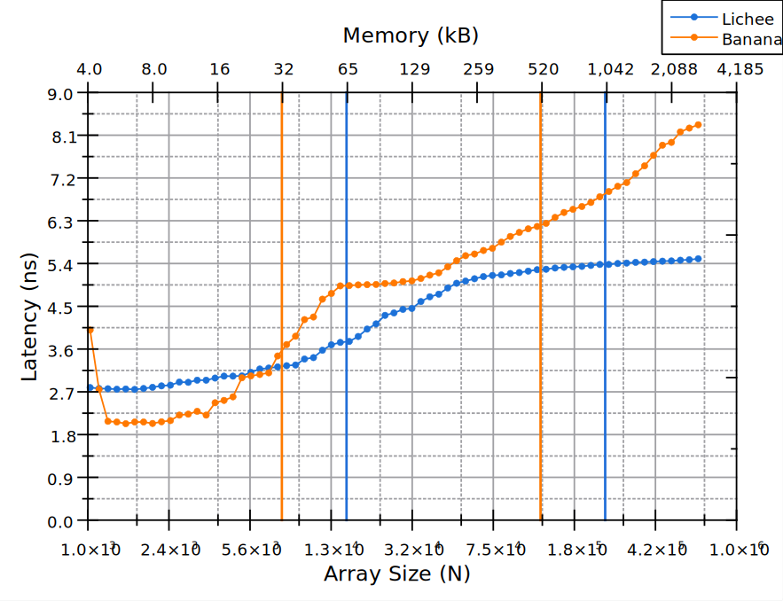

# Бенчмарки на измерение Cache Bandwidth и Cache Latency (Второй отчёт)

Данный отчёт является продолжением [первой части](./sort_benchmark.md).

Во второй части описываются бенчмарки, целью которых было измерение Cache Bandwidth и Cache Latency.

## Цель

Изначально целью второй части работы было измерение Cache Latency. Однако в качестве пререквизита для измерения Latency было решено измерить Memory Bandwidth, что в конечном итоге оказалось ощутимо сложнее.

## Методология

Для проведения бенчмарков использовались два разных подхода:

- **Sequential Memory Access** — алгоритм, который читает/пишет данные в последовательном и предсказуемом порядке.
- **Pointer Chasing** — алгоритм, проходящий по случайно связанному списку, при котором каждый доступ к памяти зависит от предыдущего, что делает невозможным предсказание следующего доступа с помощью hardware prefetcher-а.

    Пример алгоритма Pointer Chasing:

    ```C
    clock_gettime(CLOCK_MONOTONIC, &start);
    for (size_t t = 0; t < K*N; t++) {
        p->value = sink;
        p = p->next;
    }
    clock_gettime(CLOCK_MONOTONIC, &end);
    ```

Для измерения времени использовалась функция `clock_gettime`.

Заранее стоит упомянуть параметры систем памяти наших плат:

**Lichee:**

```text
The L1 data memory system has the following features:
- 64 kB I-Cache & D-Cache
- PIPT, two-way set associative L1 data cache.
- Fixed cache line length of 64 bytes.
- 128-bit read interface from the L2 memory system.
- Up to 128-bit read data paths from the data L1 memory system to the data path.
- Up to 128-bit write data path from the data path to the L1 memory system.

The L2 Cache has the following features:
- Configurable size of 256KB, 512KB, 1MB, 2MB, 4MB, or 8MB. (1MB in our case)
- PIPT, 16-way set-associative structure.
- Fixed line length of 64 bytes.
- Optional ECC protection.
- Support data prefetch.
```

Источники:

[T-HEAD XuanTie C910 RISC-V](https://www.riscvschool.com/2023/03/09/t-head-xuantie-c910-risc-v/)

**Banana:**

```text
The L1 data memory system has the following features:
- 32 kB I-Cache & D-Cache
- L1 Cache supports MESI consistency protocol
- 64 bytes line size 
- 4-way associative

The L2 Cache has the following features:
- 512 kB per cluster (4 cores)
- 0 cluster have additional 512 kB TCM memory
- L2 Cache supports MOESI consistency protocol
- 64 bytes line size
- 16-way associative
```

Источники:

[Banana Pi BPI-F3 SpacemiT K1 RISC-V chip datasheet](https://docs.banana-pi.org/en/BPI-F3/SpacemiT_K1_datasheet)

[K1 developer documentation](https://developer.spacemit.com/documentation?token=BWbGwbx7liGW21kq9lucSA6Vnpb)

## Инструменты

Общий набор инструментов остался аналогичным первой части работы ([Раздел Инструменты](./sort_benchmark.md)).

Изменения коснулись двух аспектов:

- Вместо флага компиляции `-O0` использовался флаг `-O3`, включающий оптимизации, для получения настоящих значений Bandwidth и Latency.
- Были написаны новые Bash-скрипты для автоматизации бенчмарков.

    Исходный код: [bench_cache.sh](/1.benchmarks/bondar/cache/bench_cache.sh)

    Исходный код: [bench_latency.sh](/1.benchmarks/bondar/cache/bench_latency.sh)

## Результаты исследования

### Первый результат


В коде для write-бенчмарка была допущена ошибка, которая приводила к последовательному доступу к памяти, что в теории должно было испортить данные (как мы увидим далее).

```C
clock_gettime(CLOCK_MONOTONIC, &start);
for (size_t t = 0; t < K; t++) {
    for (size_t i = 0; i < N; i++) {
        nodes[i] = sink;
    }
}
clock_gettime(CLOCK_MONOTONIC, &end);

// Правильный Pointer Chasing:

clock_gettime(CLOCK_MONOTONIC, &start);
for (size_t t = 0; t < K*N; t++) {
    p->value = sink;
    p = p->next;
}
clock_gettime(CLOCK_MONOTONIC, &end);
```

Тем не менее, мы получили на удивление красивый и гладкий график. Данный эффект требует дальнейшего изучения.

### Финальный результат


После исправления ошибки и использования медианы для сбора данных (на каждое значение N теперь берётся по 20 прогонов) были получены финальные данные.

Данные не такие красивые, но отражают общую тенденцию — снижение пропускной способности при переходе на L2-кэш. Замечено, что операции записи на Lichee и Banana имеют примерно одинаковую пропускную способность, однако в L1-кэше операции записи на Banana выполняются быстрее.

Также наблюдается снижение пропускной способности при переходе с L2-кэша на Main Memory, но это снижение не такое кардинальное, как ожидалось (всего в 2–3 раза).

Исходный код: [cache_bandwidth_pointer_chase.c](/1.benchmarks/bondar/cache/cache_bandwidth_pointer_chase.c)

### Последовательный доступ к памяти


Самые интересные эффекты наблюдаются при использовании последовательного доступа к памяти.

Исходный код: [cache_bandwidth_sequential.c](/1.benchmarks/bondar/cache/cache_bandwidth_sequential.c)

Первый график оказался не совсем корректным, поскольку при прогонах данного теста переменная, используемая для операций чтения/записи, не была объявлена как `volatile`, что привело к оптимизациям компилятором цикла.

Как видно на финальном графике:

- Пока мы находимся в L1-кэше, операции чтения и записи находятся примерно на одном уровне (при этом пропускная способность чтения выше), хотя наблюдаются большие шумы и скачки в операциях записи.
- При переходе на L2-кэш мы наблюдаем постепенный рост пропускной способности, который в итоге достигает плато и превосходит показатели L1-кэша.

Последнее наблюдение выглядит парадоксально, так как L2-кэш оказывается быстрее с точки зрения пропускной способности, чем L1-кэш.

Основной причиной подобного поведения может являться работа hardware prefetcher-а:

- В спецификации ядер, используемых на плате Lichee, явно не указано наличие prefetcher-а в L1-кэше, что, вероятно, свидетельствует об его отсутствии.
- Наличие prefetcher-а в L2-кэше явно указано в спецификации.

По мере повторения цикла prefetcher становится более эффективным, заранее подгружая данные и уменьшая количество stall cycles, что увеличивает эффективную пропускную способность памяти.

> Конечно, prefetcher — мощный инструмент, и он может быть причиной наблюдаемого эффекта. Однако достаточно странно, что L2-кэш превосходит L1-кэш по пропускной способности (при достижении плато), учитывая, что L1-кэш физически находится ближе к процессору и обладает более широкой полосой пропускания (стоит заметить, что в спецификации указана ширина полосы только для L1).

### Сравнение int и long long


Также было изучено влияние размера данных на пропускную способность.

Как видно из графиков, пропускная способность практически не отличается между использованием `int` (4 байта) и `long long` (8 байт). Это ожидаемо, учитывая размер кэш-линии в 64 байта.

Потенциально можно увидеть разницу при использовании данных, размер которых близок к размеру кэш-линии (данные тесты, к сожалению, не были проведены из-за отсутствия времени).

Исходный код: [cache_bandwidth_longlong.c](/1.benchmarks/bondar/cache/cache_bandwidth_longlong.c)

### Количество рабочих циклов

#### K = 10


#### K = 1000


Было изучено влияние количества рабочих циклов `K` на пропускную способность.

Несмотря на использование алгоритма Pointer Chasing, при увеличении количества итераций цикла (в 100 раз) мы получаем примерно в 3 раза большую пропускную способность для операций записи и на 20% для операций чтения (в L2-кэше).

### Измерение Latency



В конечном счёте, уже в последний день зимней школы, были проведены измерения задержек памяти. С первой попытки мы получили красивый график, очень похожий на реальные показатели.

> Уже после окончания экспериментов была обнаружена ошибка в bash-скрипте. При вычислении медианы между итерациями не очищался массив, из которого брались данные, вследствие чего значения задержки для L2-кэша и Main Memory, вероятно, получились меньше, чем в реальности. Тем не менее, результаты для L1-кэша можно считать достоверными.

Исходный код: [latency.c](/1.benchmarks/bondar/cache/latency.c)

## Как воспроизвести бенчмарки

1. Для бенчмарков Memory Bandwidth:

    ```bash
    gcc -O3 -o measure cache_bandwidth_*.c
    bash bench_cache.sh LOG_FILE
    ```

2. Для бенчмарков Latency:

    ```bash
    gcc -O3 -o lat latency.c
    bash bench_latency.sh LOG_FILE MIN MAX
    ```

## Заключение

Полученные результаты демонстрируют, что пропускная способность памяти существенно зависит от уровня кэширования и характера доступа, при этом аппаратные оптимизации, такие как prefetcher, играют важную роль в эффективности передачи данных.

При этом задержка памяти является более простым для измерения и анализа параметром.

## Будущая работа

- Изучить более подробно влияние оптимизаций на получаемые данные.
- Существуют хитрые "хаки" для более точных и стабильных измерений пропускной способности и задержки. Многие из таких "хаков" платформо-специфичны, поэтому может потребоваться адаптация под RISC-V.
- Изучить более подробно возможность измерения задержек с помощью sequential acces алгоритма.
