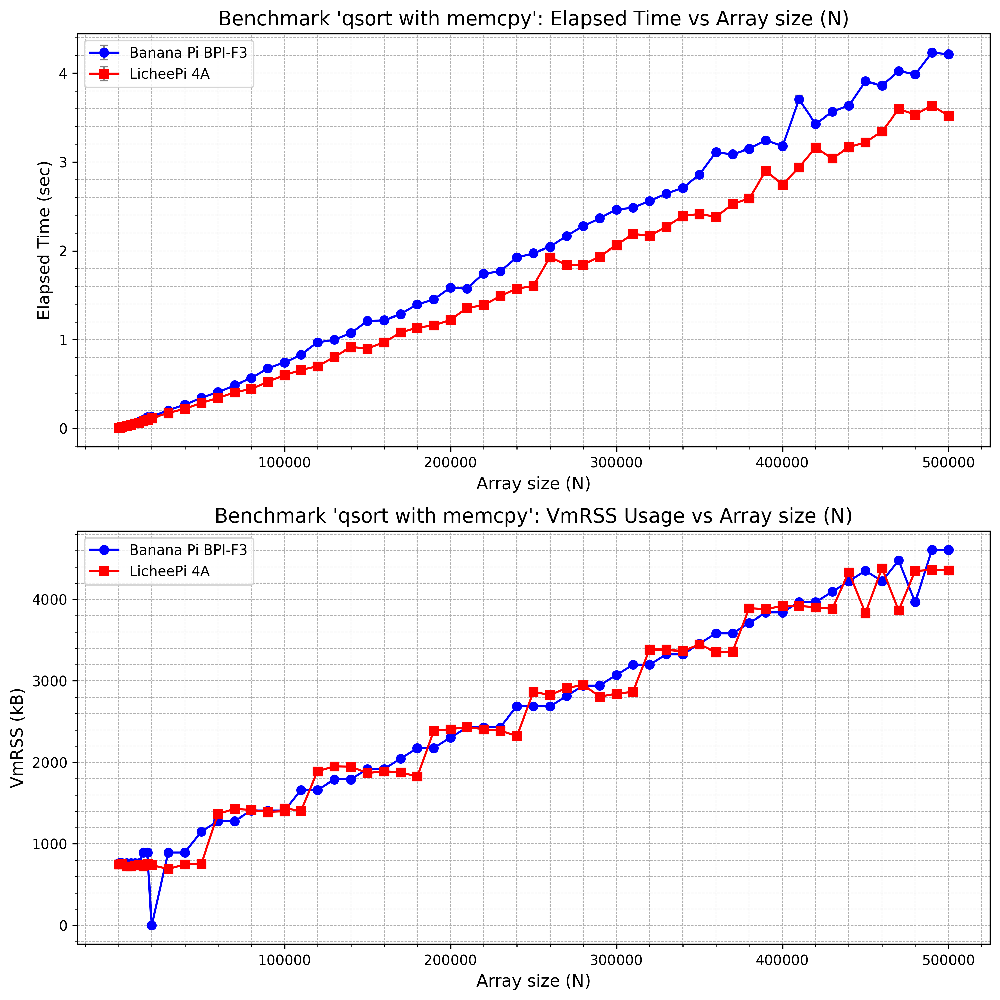
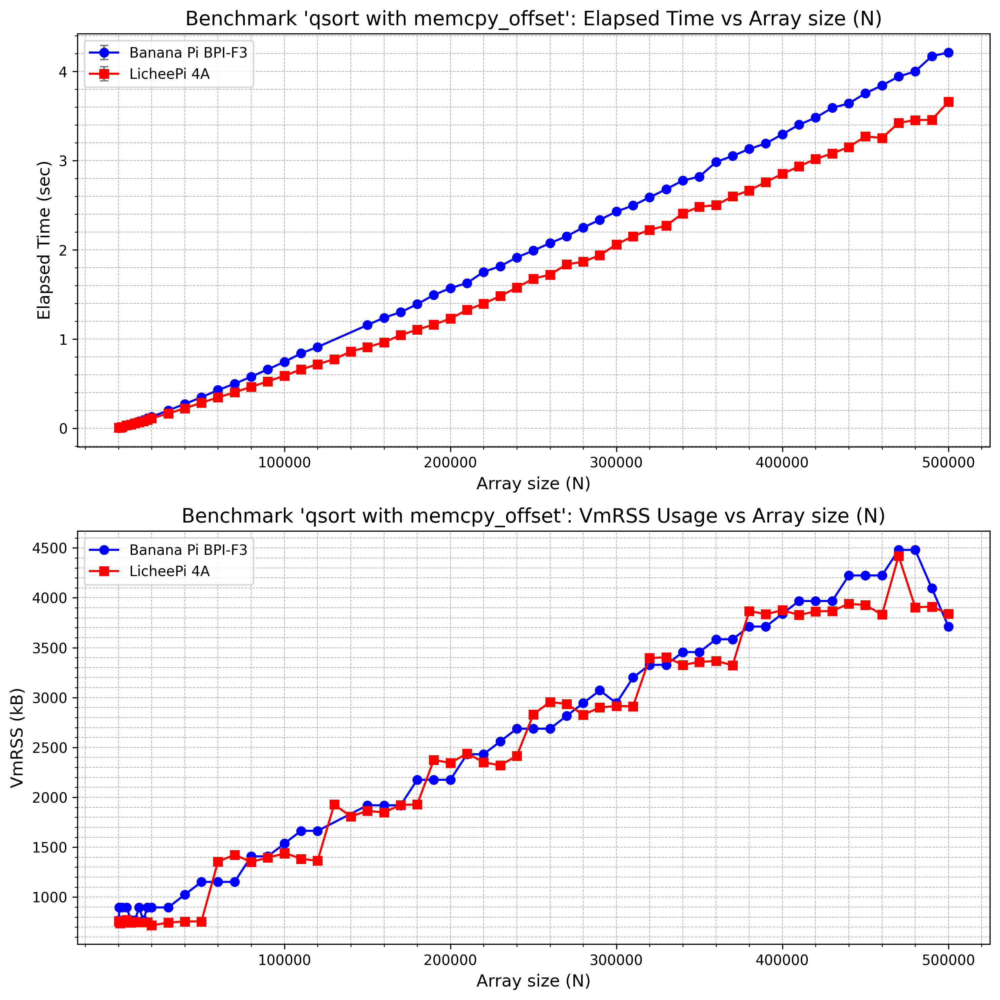
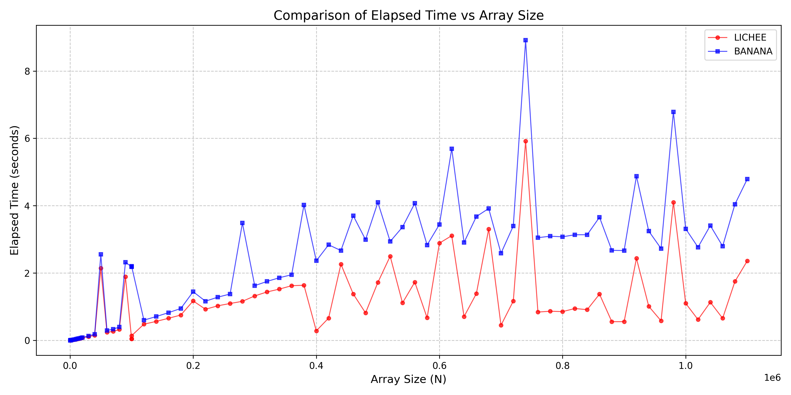
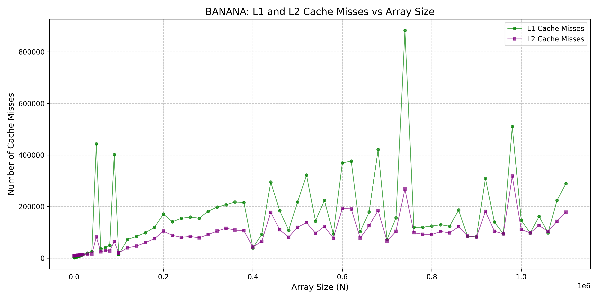
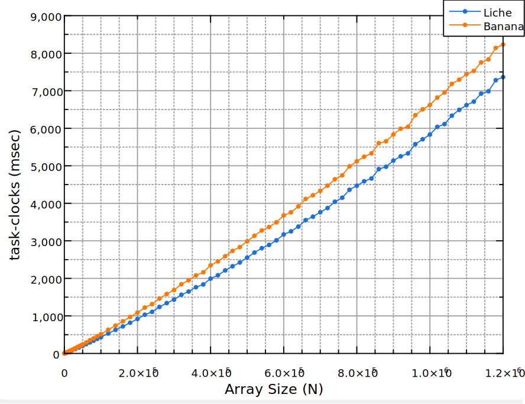
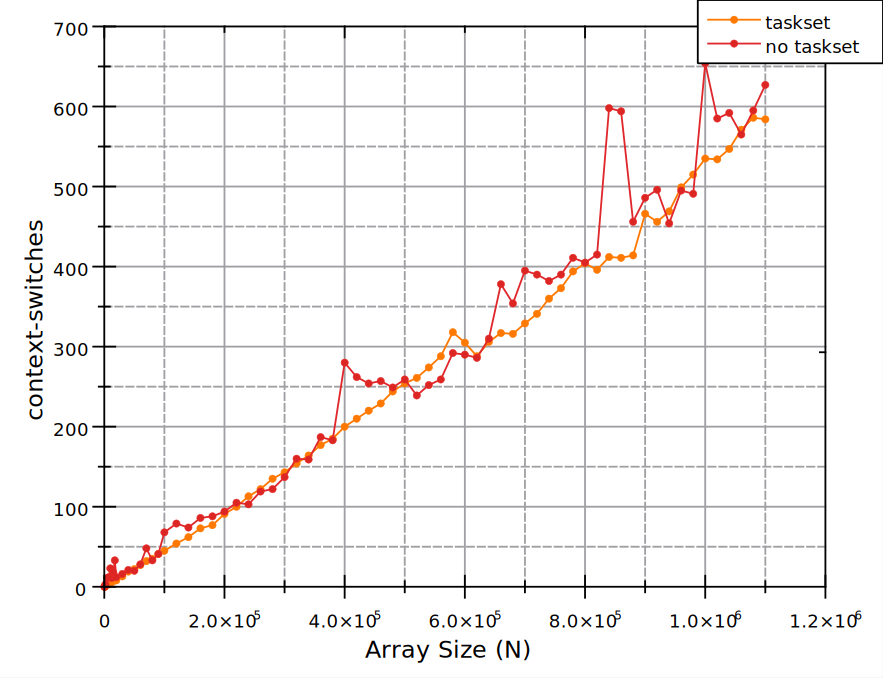
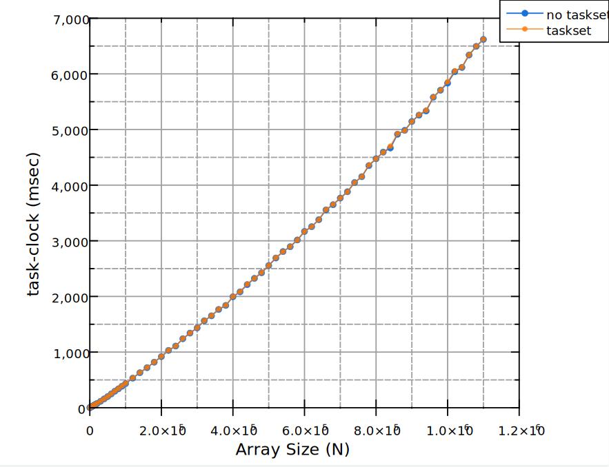
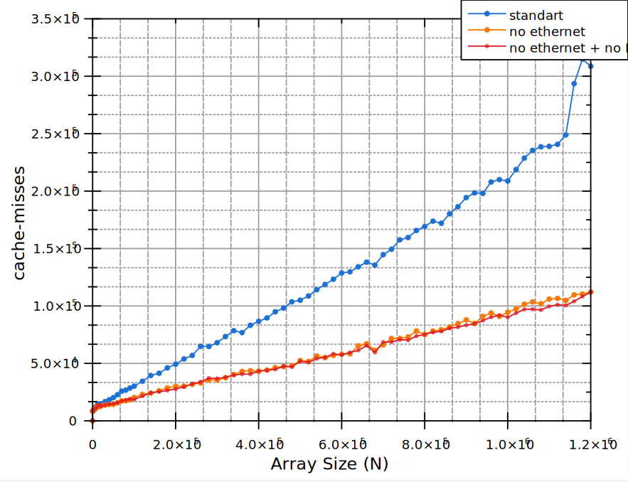
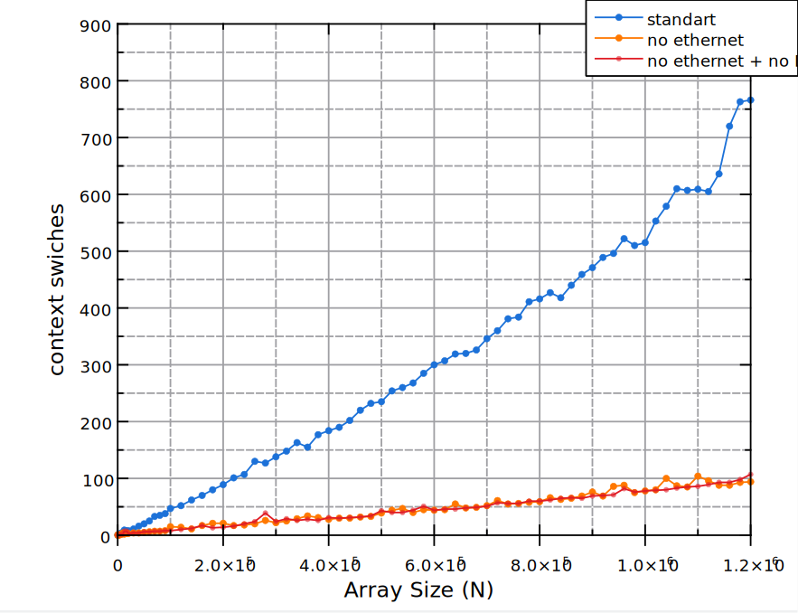

# Бенчмарк Quicksort (Первый отчет)

В этом отчете описывается процесс и результаты бенчмаркинга алгоритма quicksort, который был выполнен во время зимней школы YADRO 2025 по архитектуре RISC-V.

## Цель

Целями данной части работы были:

1. Оценка производительности алгоритма быстрой сортировки на платформе RISC-V и сравнение 2 тестируемых плат.
2. Получение практического опыта работы с инструментами анализа производительности:
   - Изучение инструментов performance профилирования (`perf`, `gprof`)
   - Развитие навыков выявления узких мест производительности
3. Получение опыта чтения и анализа ассемблера RISC V.

## Методология

### Алгоритм и обеспечение консистентности данных

Был реализован стандартный алгоритм быстрой сортировки на языке C.

Для оценки производительности алгоритма сортировка запускалась в цикле M раз. Это позволило увеличить долю времени выполнения, затрачиваемого непосредственно на сам алгоритм, и минимизировать влияние подготовительных операций.

Протестированны разные способы перетасовки сортируемого массива между циклами с целью получить единый способ проведения экспериментов с детерминированными и консистентными между прогонами данными.

При этом случайный массив для сортировки генерировался отдельным Python скриптом в виде header-файла `random_data.h` с `static` массивом. Данный header-файл подключается на этапе сборки и из него берутся данные для сортировки.

Исходный код: [rand_gen.py](/1.benchmarks/bondar/qsort_bench/rand_gen.py)

#### Версия с XOR и memcpy

В начале каждого цикла массив размера N копируется в рабочий буфер, после чего к каждому элементу применяется операция XOR с итерацией цикла, умноженной на большое простое число.

Этот метод является детерминированным, так как начальная точка (`base_array`) остается неизменной, и все операции XOR применяются к одинаковой последовательности чисел.

```C
    for (int cycle = 0; cycle < M; cycle++) {
        memcpy(buffer, base_array, N * sizeof(int));
        
        for (int i = 0; i < N; i++) {
            buffer[i] ^= (cycle * 0x5bd1e995);
        }
        
        quicksort(buffer, 0, N - 1);
    }
```

Результаты:

- Для N = 1000, M = 5000: ~17.7% branch misses.
- Для N = 10000, M = 500: ~19% branch misses.
- Доля времени, затрачиваемого на сортировку (измерено через `gprof`):
  - 91.2% in `quicksort` (N = 1000, 5000 cycles)
  - 93.6% in `quicksort` (N = 10000, 500 cycles)
  - 96.2% in `quicksort` (N = 100, 50000 cycles)

Также был измерен процент промахов предсказаний ветвлений (branch misses) с помощью `perf stat` для исследования возможности "обмануть" предсказатель ветвлений (Branch Predictor) и получить с помощью перетасовки больший процент ошибок.

Как будет видно далее из результатов других реализаций, процент ошибок предсказаний слабо зависит от способа перетасовки массива.

Для достижения большего процента ошибок необходимо изменять внутреннюю логику алгоритма, например, механизм выбора опорного элемента (пивота).

Хорошая статья на эту тему: [Analysis of Branch Misses in Quicksort](https://www.wild-inter.net/publications/martinez-nebel-wild-2015).

Ввиду ограниченности времени тесты с альтернативными реализациями алгоритма не были проведены, к тому же это не являлось основной задачей исследования.

Исходный код: [sort_memcpy_xor.c](/1.benchmarks/bondar/qsort_bench/sort_memcpy_xor.c)

#### Версия scramble

Данная версия использует небольшую хэш-функцию для модификации элементов массива перед каждым прогоном сортировки.

```C
void scramble(int *arr, int n, int cycle) {
    for (int i = 0; i < n; i++) {
        unsigned int seed = (cycle * 0x5bd1e995) + (i * 0xdeadbeef);
        seed ^= (seed >> 16);

        arr[i] ^= seed; 
        arr[i] = (arr[i] << 3) | (arr[i] >> (32 - 3)); 
        arr[i] += (seed ^ 0x9e3779b9);
    }
}

...

    for (int cycle = 0; cycle < M; cycle++) {
        scramble(buffer, N, cycle);
        quicksort(buffer, 0, N - 1);
    }
```

Метод является полностью детерминированным, так как все преобразования зависят от начальных данных (`base_array`) и номера текущей итерации (`cycle`).

Результаты:

- Для N = 1000, M = 5000: ~17% branch misses.
- Для N = 10000, M = 500: ~18.65% branch misses.
- Доля времени, затрачиваемого на сортировку (измерено через `gprof`):
  - 84% in `quicksort` (N = 1000, 5000 cycles)
  - 82% in `quicksort` (N = 10000, 500 cycles)
  - 87.4% in `quicksort` (N = 100, 50000 cycles)

Недостаток данного подхода — дополнительный оверхед из-за вычисления хэш-функции, что снижает долю времени, затрачиваемого непосредственно на выполнение алгоритма сортировки.

Процент промахов предсказаний ветвлений в этой версии сопоставим с другими методами перетасовки массива. Это подтверждает гипотезу, что способ перетасовки слабо влияет на работу Branch Predictor.

Исходный код: [sort_scramble.c](/1.benchmarks/bondar/qsort_bench/sort_scramble.c)

#### Версия memcpy with offset

```C
    size_t max_offset = BASE_ARRAY_SIZE - N;
    const unsigned prime = 0x5bd1e995; 

    for (int cycle = 0; cycle < M; cycle++) {
        size_t offset = ((1ull * cycle * prime) % (max_offset + 1));
        memcpy(buffer, base_array + offset, N * sizeof(short));
        
        quicksort(buffer, 0, N - 1);
    }
```

 1000 5000 (r = 5) --> 18.57% miss
 10000 500 (r = 10) --> 20% miss
 100000 300 (r = 20) --> 20.62% miss

 ~ 99% in sort (1000 5000)
 ~ 99-100% in sort (10000 500)
 ~ 99-100% in sort (100 50000)

Исходный код: [sort_memcpy_with_offset.c](/1.benchmarks/bondar/qsort_bench/sort_memcpy_with_offset.c)

1) Код скомпилирован с использованием RISC-V GCC toolchain.
2) Бенчмарк выполнен на платах RISC-V.
3) Автоматизировано

## Инструменты

В ходе работы были использованны

## Результаты исследования

### Первый результат




### Важность





### Финальный результат




### Измерение влияния внешнего шума









Factors list:
 cache speed
 ram speed
 bus speed
 clock speed

## Как воспроизвести бенчмарки

### Скрипты автоматизации

...

## Заключение

## Будущая работа

Дальнейшее исследование влияния внешнего шума и определение наилучшей среды для выполнения бенчмарков:

- прерывания
- планировщик реального времени (необходимость для ядра 6.*)
-
